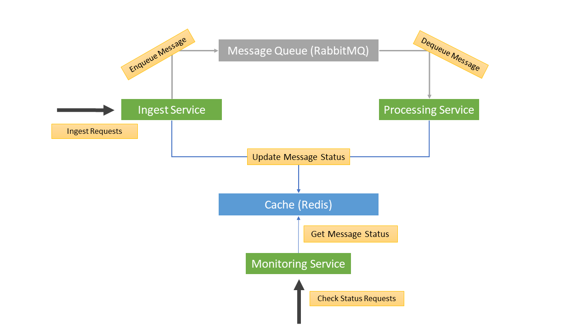

# Messages Processing System 

## Overview ##
This repository contains a demo of a basic message processing system.
The system includes the following components:
* Ingest Service - Ingestion of new messages into the system
* Processing Service - Processing of each message ingested into the system
* Monitoring Service - Tracking of ingested messages status
* RabbitMq - Messaging queue between services
* Redis - Cache for messages status tracking



## Installation ##
The demo and third parties were installed and tested on a Windows machine.
Third parties configurations were set to defaults (such as: listening port, localhostas host, etc).

These are the steps needed in order to run all the components in the system.

**RabbitMQ**
- Download and install Erlang (installer): http://erlang.org/download/otp_win64_22.0.exe
- Download rabbitMQ - (manual):  From "/tools" directory in this repo  or at https://www.rabbitmq.com/install-windows-manual.html.
- Open the command line and go to RabbitMQ sbin directory.
  - Execute **rabbitmq-server.bat** to start RabbitMQ.
  - Execute **rabbitmq-plugins enable rabbitmq_management** to enable the management portal.

**Redis**
- Download redis for windows (Zip file): https://github.com/microsoftarchive/redis/releases/tag/win-2.8.2400 
- Go to Redis directory
  - Execute **redis-server.exe** to start redis

**Redis Desktop Manager**
- (Optional) You can also download and install RedisDesktopManager to visualize the contentn of redis from: 

**Services**
- Go to directoy "/binaries" in this repo and you'll find all services jars
- Start each service by running its jar (Use different CMD windows, one for each service )
  - java -jar ingest-service-0.0.1-SNAPSHOT-spring-boot.jar
  - java -jar processing-service-0.0.1-SNAPSHOT-spring-boot.jar
  - java -jar monitoring-service-0.0.1-SNAPSHOT-spring-boot.jar

That's it!

## Rest APIs ##
There are two Rest API:
* Message Status API
* Ingest Message API 

### Message Status API ###
There's one API for checking the status of a specific messages (Statuses are kept for 20 min) 

**Request**
```
GET /message-statuses/{messageId}
Host: localhost:9003
Content-Type: application/json
```
**Response (200 OK)**
```
{
  "messageId": {messageId},
  "status": {messageStatus}
}
```
**Response (400 BadRequest, 404 NotFound, 500 InternalServerError)**
```
{
  "details": "description of problem/error"
}
```
**Examples**
```
EXAMPLE1 - (MessageId was found and status is returned)
Request:
    GET /message-statuses/74ffbca8-c543-4e53-a389-4643cbd2807d HTTP/1.1
    Host: localhost:9003
    Content-Type: application/json
Response:
    200 OK
    {
      "messageId": "74ffbca8-c543-4e53-a389-4643cbd2807d",
      "status": "COMPLETED"
    }


EXAMPLE2 - (messageId doesn't exist)
Request:
    GET /message-statuses/05c2b18f-d240-49ca-8c10-b7d8ba1b381f HTTP/1.1
    Host: localhost:9003
    Content-Type: application/json
Response:
    404 Not Found
    {
      "details": "Status was not found for messageId:05c2b18f-d240-49ca-8c10-b7d8ba1b381f"
    }
```


### Ingest Message API ###

**Request**
```
POST /ingest-messages HTTP/1.1
Host: localhost:9001
Content-Type: application/json
Body:
    {
      "body": {messagePayload}
    }
```

**Response (200 OK)**
```
{
  "messageId": "{generatedMessageId}"
}
```
**Response (400 BadRequest, 500 InternalServerError)**
```
{
  "details": "description of problem/error"
}
```


**Examples**
```
EXAMPLE1 - (happy flow)
Request:
    POST /ingest-messages HTTP/1.1
    Host: localhost:9001
    Content-Type: application/json
    Body:
      {
        "body": "message payload here"
      }
Response:
    200 OK
    {
      "messageId": "8ab93084-8dc5-4eb6-99d8-e379595a95a7"
    }


EXAMPLE2 - (Invalid message payload)
Request:
    POST /ingest-messages HTTP/1.1
    Host: localhost:9001
    Content-Type: application/json
    Body:
      {
        "body": ""
      }
Response:
    400 Bad Request
    {
      "details": "Invalid ingest message payload"
    }